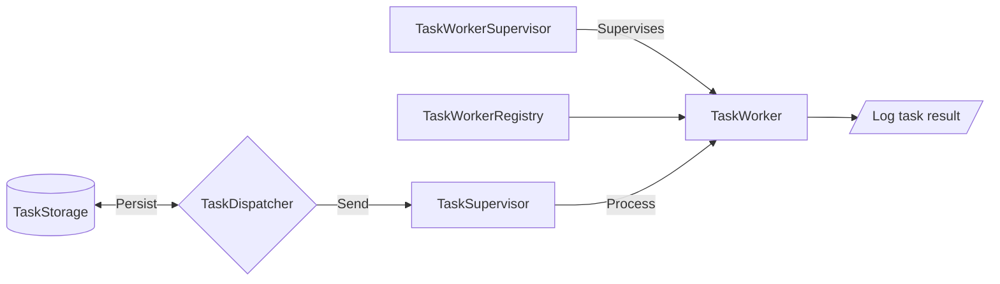

# TaskSystem


## 🏬 Architecture



## 💻 Local development

1. Clone the repository

```bash
git clone https://github.com/quentin-rodriguez/task-system.git
cd task-system
```

2. Change Version for elixir and erlang

If possible, use the versions specified in the `.tool-versions` file with a tool such as [mise](https://github.com/jdx/mise) or [asdf](https://github.com/asdf-vm/asdf).

```bash
mise install
# or
asdf install
```

3. Install dependencies

```bash
mix deps.get
```

4. Start the application

```bash
iex -S mix
```

5. (Optional) You can use the following url to interact with the project: [http://localhost:4000/tasks](http://localhost:4000/tasks)

`curl` requests can be used to communicate with the API

Create a new task
```bash
curl -X POST http://localhost:4000/tasks -d '{"name": "Jean", "number": "42"}'
```

Get a list of running tasks
```bash
curl -X GET http://localhost:4000/tasks
```

Stop a running task
```bash
curl -X DELETE http://localhost:4000/tasks/:id
```

## 📥 Production deployment