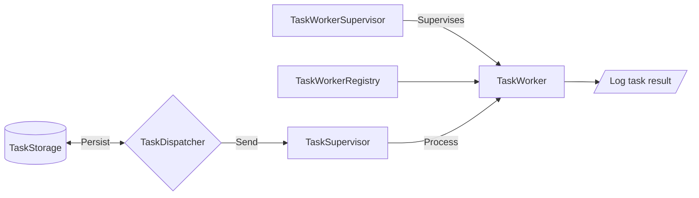

# TaskSystem

## 🏬 Architecture

```mermaid
flowchart LR
    TWS[TaskWorkerSupervisor] -- Supervises --> TW[TaskWorker]
    TR[TaskWorkerRegistry] --> TW
    TST[(TaskStorage)] <-- Persist --> TD{TaskDispatcher} 
    TD -- Send --> TS[TaskSupervisor]
    TS -- Process --> TW
    TW --> LOG@{ shape: lean-r, label: "Log task result" }
```

