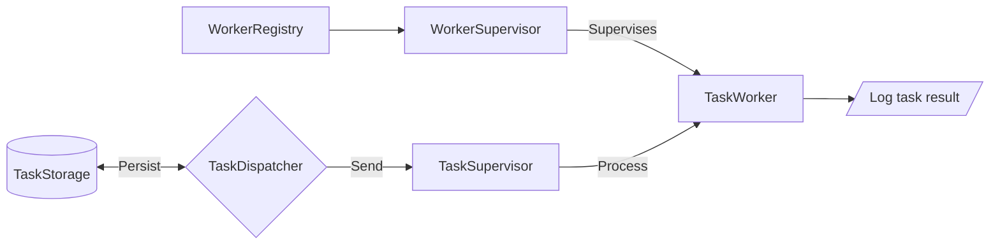

# TaskSystem

## Architecture

```mermaid
flowchart LR
    TR[WorkerRegistry] --> TWS[WorkerSupervisor]
    TWS -- Supervises --> TW[TaskWorker]
    TST[(TaskStorage)] <-- Persist --> TD{TaskDispatcher} 
    TD -- Send --> TS[TaskSupervisor]
    TS -- Process --> TW
    TW --> LOG@{ shape: lean-r, label: "Log task result" }
```

